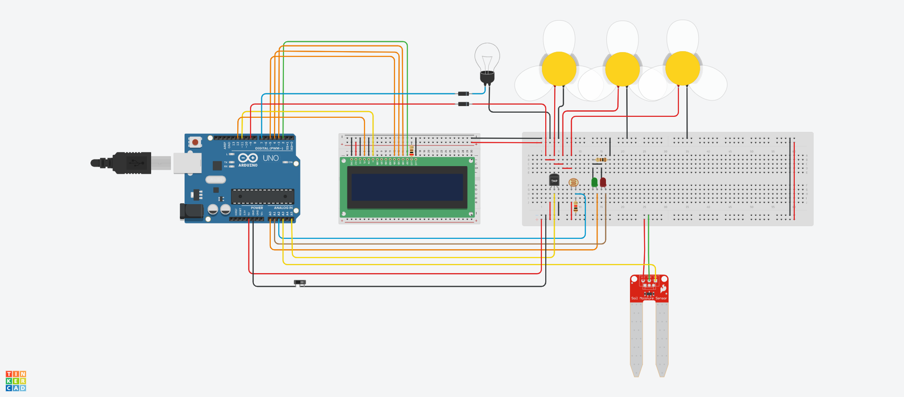

# Smart Farm System (SmFS)
A simple IoT project that can automate the facilities (such as lights, cooling system, irrigation system) according to the sensors in the smart farm. Based on Arduino Uno R3.

> the slide-switch should not be here for the real-world design, because the Arduino never stops once it starts.

## Main Components
- LCD 16x2
- Photoresistor
- Soil Moisture Sensor
- Temperature Sensor (TMP36)
- Light bulb
- DC Motor (Fan)
- LEDs

| Name     | Quantity | Component                  |
| -------- | :------: | -------------------------- |
| U1       |    1     | Arduino Uno R3             |
| SEN3     |    1     | Soil Moisture Sensor       |
| U6       |    1     | LCD 16 x 2                 |
| U7       |    1     | Temperature Sensor [TMP36] |
| R1       |    1     | Photoresistor              |
| R3       |    1     | 200 Ω Resistor             |
| R2       |    1     | 1 kΩ Resistor              |
| D1       |    1     | Green LED                  |
| D2       |    1     | Red LED                    |
| M1 M5 M6 |    3     | DC Motor                   |
| R4       |    1     | 100 Ω Resistor             |
| L1       |    1     | Light bulb                 |
| S1       |    1     | Slideswitch                |
| D3 D4    |    2     | Diode                      |
